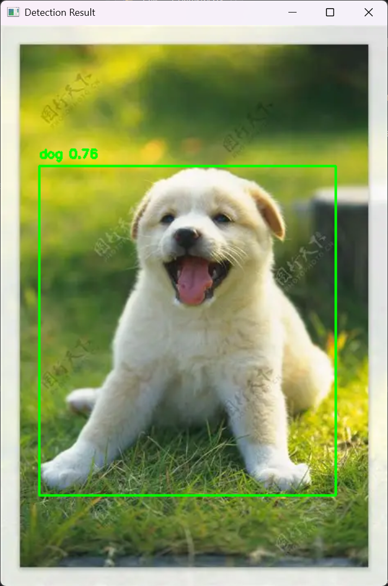

# 基于 YOLOv8 的目标检测系统

## 项目简介

本项目是一个基于 Python、OpenCV 和 YOLOv8 的目标检测系统，支持图片目标检测、摄像头实时目标检测以及 ONNX 模型部署测试。项目通过调用 YOLOv8 预训练模型，实现对图像或视频流中目标的识别，并能够显示检测框、类别名称、置信度和 FPS 等信息。

本项目主要用于学习深度学习目标检测的基本流程，包括模型加载、图像推理、检测结果可视化以及模型部署测试。

## 项目功能

* 支持单张图片目标检测
* 支持摄像头实时目标检测
* 支持 YOLOv8 预训练模型加载与推理
* 支持检测框、类别名称和置信度显示
* 支持 FPS 实时统计
* 支持将 YOLOv8 模型导出为 ONNX 格式
* 支持基于 OpenCV DNN 的 ONNX 模型推理测试
* 提供交互式菜单，方便选择不同检测模式

## 技术栈

* Python
* OpenCV
* Ultralytics YOLOv8
* PyTorch
* NumPy
* ONNX
* OpenCV DNN

## 项目结构

```text
YOLOv8-Object-Detection/
│
├── yolov8_object_detection.py    # 主程序代码
├── requirements.txt              # 项目依赖
├── test.png                      # 测试图片
├── README.md                     # 项目说明文档
└── assets/
    └── dog_detection.png         # 图片目标检测运行结果
```

## 环境安装

安装项目所需依赖：

```bash
pip install ultralytics
pip install opencv-python
pip install numpy
pip install torch torchvision
```

也可以通过 `requirements.txt` 一次性安装：

```bash
pip install -r requirements.txt
```

## 运行方式

运行主程序：

```bash
python yolov8_object_detection.py
```

程序启动后，会出现功能菜单：

```text
请选择功能:
1. 图像目标检测（YOLOv8）
2. 实时视频检测（YOLOv8）
3. 优化模型实时检测（OpenCV DNN + ONNX）
4. 退出
```

## 图片目标检测示例

选择功能 `1`，输入测试图片路径，例如：

```text
test.png
```

程序会对图片中的目标进行检测，并显示检测框、类别名称和置信度。

运行效果如下：



从检测结果可以看到，模型成功识别出了图片中的小狗目标，并显示了目标类别 `dog` 和对应的置信度。

## 核心功能说明

### 1. 图片目标检测

使用 YOLOv8 预训练模型对输入图片进行目标检测，获取目标类别、置信度和检测框坐标，并使用 OpenCV 将检测结果绘制到图片上。

### 2. 实时视频检测

调用电脑摄像头或视频文件，对每一帧画面进行目标检测，并实时显示检测结果和 FPS。该功能主要用于验证模型在实时场景下的运行效果。

### 3. ONNX 模型部署测试

将 YOLOv8 模型导出为 ONNX 格式，并使用 OpenCV DNN 进行 CPU 端推理测试，用于了解模型部署和推理优化的基本流程。

## 实验结果

本项目完成了 YOLOv8 目标检测系统的基本搭建，并成功实现图片目标检测功能。测试图片中，小狗目标能够被模型正确识别，检测框位置较准确，类别和置信度能够正常显示。

同时，项目还实现了摄像头实时检测和 ONNX 模型部署测试功能，用于进一步验证目标检测模型在不同输入方式和部署方式下的运行效果。

## 项目收获

通过本项目，我熟悉了 YOLOv8 目标检测模型的基本使用方法，掌握了 Python 调用预训练模型进行目标检测的流程，并了解了 OpenCV 在图像读取、检测框绘制、文字显示和视频流处理中的应用。同时，也对 ONNX 模型导出和 OpenCV DNN 推理部署有了初步了解。

## 后续优化方向

* 增加检测结果图片自动保存功能
* 增加视频检测结果保存功能
* 优化 ONNX 模型推理速度
* 增加图形化界面，提高项目易用性
* 使用自定义数据集训练模型，提高特定场景下的检测效果
* 尝试使用 GPU 或 TensorRT 提升推理速度

## 项目总结

本项目实现了一个基础的 YOLOv8 目标检测系统，完成了图片检测、实时检测和模型部署测试等功能。项目结构简单清晰，适合作为深度学习目标检测方向的入门实践项目。
